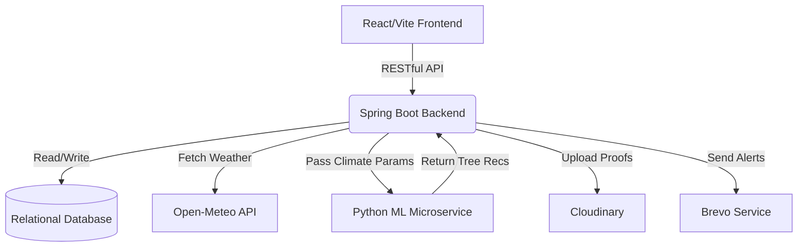

# 🌍 TerraSpotter: Mapping the Right Place to Plant


**TerraSpotter** is an innovative, full-stack platform designed to revolutionize community-driven tree plantation. It shifts the focus from simply *tracking* planted trees to proactively identifying **where** to plant, estimating **how many** trees can be planted, and predicting **what** species will survive using Machine Learning and geographical data.

---

## 🚀 The Problem & The Solution

**The Problem:** Many community plantation drives suffer from high sapling mortality rates. Trees are planted without analyzing the local climate, soil moisture, or spatial capacity, leading to overcrowded and unsuitable plantations. 

**The Solution:** TerraSpotter bridges the gap between environmental enthusiasm and actionable, data-driven planting. By integrating gamification to drive user engagement and Machine Learning to optimize species selection, TerraSpotter ensures that every tree planted has the highest statistical chance of survival.

---

## ✨ Key Features & Differentiators (MSP)

### 🧠 1. ML-Powered Plant Recommendations
Instead of guesswork, the platform pulls real-time and historical data (1-year annual rainfall, 7-day mean temperature, soil moisture) via the **Open-Meteo API**. This is fed into an external Python ML microservice via REST, which returns a ranked list of recommended tree species tailored to the exact GPS coordinates.

### 📐 2. Tree Count Estimation via Spatial Grid Algorithm
Using advanced computational geometry, TerraSpotter projects a localized 3x3 meter grid over user-submitted irregular land polygons. A **Ray-Casting Point-in-Polygon** algorithm computes the precise maximum sustainable tree capacity, preventing overcrowding.

### 🎮 3. Advanced Gamification Engine
To ensure high user retention, TerraSpotter turns planting into a rewarding experience. Users earn Experience Points (XP), maintain daily streaks, and unlock unique badges (e.g., "Eco Legend") for verifying lands, planting trees, and submitting growth updates.

### 📍 4. Interactive Geolocation Land Mapping
Users can map out vacant lands using an interactive map (`react-leaflet`). The platform strictly tracks the lifecycle of the land: `Vacant` ➔ `Under Plantation` ➔ `Plantation Complete`.

### 🛡️ 5. Verified Proof-of-Work & Safety
No fake points! Plantations and growth updates require mandatory geo-tagged photo uploads powered by **Cloudinary**. Furthermore, an automated `ProfanityFilterService` keeps community reviews clean, and the platform features full **i18n** multilanguage support to cater to rural farmers.

---

## 🛠️ Tech Stack

### Frontend
*   **Core:** React 19, Vite, TypeScript/JavaScript
*   **Styling:** Tailwind CSS v4, Framer Motion (Animations), tw-animate-css
*   **Maps & Charts:** React-Leaflet, Leaflet-Draw, Recharts
*   **State & Utils:** React Router DOM, i18next (Localization), JWT Decode

### Backend
*   **Core:** Java, Spring Boot
*   **Database:** PostgreSQL / MySQL (via Spring Data JPA)
*   **Architecture:** Monolith with RESTful API endpoints bridging to an ML microservice.

### External APIs & Integrations
*   **Open-Meteo API:** For localized weather and soil analytics.
*   **Cloudinary:** For CDN-hosted image proofs.
*   **Brevo (Sendinblue):** For automated transactional emails.
*   **Google OAuth:** For seamless secure logins.

---

## ⚙️ Local Development Setup

### Prerequisites
- Node.js (v18+)
- Java 17+
- Maven
- External API Keys (Cloudinary, Brevo)

### 1. Backend Setup (Spring Boot)
1. Navigate to the `backend` directory.
2. Configure your `src/main/resources/application.properties` with your Database, Cloudinary, and Brevo credentials.
3. Build and run the project:
   ```bash
   mvn clean install
   mvn spring-boot:run
   ```

### 2. Frontend Setup (React/Vite)
1. Navigate to the `frontend` directory.
2. Install dependencies:
   ```bash
   npm install
   ```
3. Set up your `.env` file with backend and API keys (e.g., Google Client ID).
4. Start the development server:
   ```bash
   npm run dev
   ```

---

## 📈 Platform Analytics
TerraSpotter includes a global `StatsService` that aggregates plot-by-plot data to display real-time environmental impact to the public—translating raw tree counts into tangible metrics like "Hectares of New Green Zones Established."

---

## 🏗️ System Architecture

TerraSpotter follows a modular microservice-ready architecture, ensuring high scalability and separation of concerns.



---

## 🗺️ Future Roadmap
- [ ] **Drone Image Analysis:** Integrate computer vision models to verify tree growth via drone top-down imagery.
- [ ] **Carbon Credit Calculation:** Translate the verified planted trees into estimated carbon offset credits.
- [ ] **Mobile App Port:** Wrap the progressive web app into React Native for offline tracking in remote areas.

---

## 🤝 Contributing
Contributions, issues, and feature requests are highly welcome! 
1. Fork the Project
2. Create your Feature Branch (`git checkout -b feature/AmazingFeature`)
3. Commit your Changes (`git commit -m 'Add some AmazingFeature'`)
4. Push to the Branch (`git push origin feature/AmazingFeature`)
5. Open a Pull Request

---

## 📄 License
Distributed under the MIT License. See `LICENSE` for more information.

---

*Made with ❤️ for a Greener Planet.*
