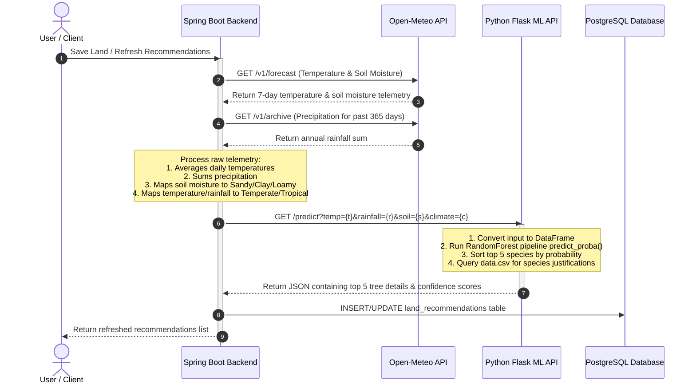

# Chapter 6.3 Recommendation Algorithm

## 6.3.1 Overview of Recommendation Engine
The core value proposition of the **TerraSpotter** platform lies in scientific and precision-driven afforestation. To solve the "Plantation Paradox" — where high sapling mortality rates occur due to improper species-soil-climate matching — the platform integrates a Python-based Machine Learning recommendation microservice.

This microservice acts as a predictive engine that assesses the environmental telemetry of a selected land plot and returns the top 5 most compatible tree species alongside their statistical suitability confidence scores and botanical reasons.

---

## 6.3.2 Machine Learning Algorithm & Hyperparameters
The recommendation engine uses a **Random Forest Classifier** (`sklearn.ensemble.RandomForestClassifier`). 

### Rationale for Random Forest
1. **Handling Categorical and Numerical Inputs:** Random Forest seamlessly handles mixed data types (continuous weather parameters and discrete categorical soil and climate classifications).
2. **Robustness to Overfitting:** The ensemble nature of decision trees built on bootstrap samples (bagging) with random feature selection protects the model from overfitting to specific climate records.
3. **Probability Estimations:** It provides well-calibrated class probability outputs (`predict_proba`) which translate directly into the "Suitability Confidence Scores" shown to the user on the frontend map.

### Model Hyperparameters
The model is configured with the following parameters:
- **`n_estimators = 200`**: The forest consists of 200 individual decision trees to ensure stable, robust prediction boundaries.
- **`max_depth = 10`**: Limits tree growth to a maximum depth of 10 levels, pruning overly specific leaves to prevent overfitting and ensure generalized rules.
- **`random_state = 42`**: Seed value ensuring deterministic training runs and reproducible outputs.

---

## 6.3.3 Dataset Specifications
- **Dataset File Location:** `models/data/data.csv` (absolute path: `d:\TerraSpotter-Mapping-the-Right-Place-to-Plant\models\data\data.csv`).
- **Total Dataset Records:** 500 records.
- **Data Balance:** Evenly distributed, containing 25 records for each of the 20 supported tree species classes.

---

## 6.3.4 Features & Target Variables
The model uses a combination of continuous variables, categorical inputs, and textual metadata:

### Feature Columns (Inputs)
1. **`temp_avg` (Numerical, Continuous):** Calculated as the mean temperature in degrees Celsius (derived from Open-Meteo forecasts).
2. **`rainfall_avg` (Numerical, Continuous):** The average annual precipitation in millimeters (derived from Open-Meteo historical archives).
3. **`soil` (Categorical, Nominal):** Represents the soil type of the land. Supported values:
   - `sandy`
   - `clay`
   - `loamy`
4. **`climate_zone` (Categorical, Nominal):** Represents the environmental climate category. Supported values:
   - `tropical`
   - `temperate`

### Target Variable (Output Class)
- **`tree_name` (Categorical, Nominal):** The target variable representing one of the 20 supported tree species.

---

## 6.3.5 Data Preprocessing & Feature Engineering
Data transformation is encapsulated in a scikit-learn `Pipeline` to ensure a consistent data flow during training and runtime inference:

1. **Feature Extraction & Engineering:**
   - At training time, average temperature (`temp_avg`) and average rainfall (`rainfall_avg`) are engineered from the minimum and maximum dataset thresholds:
     $$\text{temp\_avg} = \frac{\text{temp\_min} + \text{temp\_max}}{2}$$
     $$\text{rainfall\_avg} = \frac{\text{rainfall\_min} + \text{rainfall\_max}}{2}$$
2. **Synthetic Data Augmentation (Gaussian Noise):**
   - To make the model robust against rigid classification boundaries and simulate environmental fluctuations, zero-mean Gaussian noise is added to the continuous features during model training:
     $$\text{temp\_avg} = \text{temp\_avg} + \mathcal{N}(0, 2)$$
     $$\text{rainfall\_avg} = \text{rainfall\_avg} + \mathcal{N}(0, 2)$$
3. **Pipeline Transformers:**
   - **Column Transformer:**
     - **One-Hot Encoding:** Categorical columns (`soil` and `climate_zone`) are converted into binary vectors using `OneHotEncoder(handle_unknown="ignore")`.
     - **Passthrough:** Continuous columns (`temp_avg` and `rainfall_avg`) pass through without scaling, preserving the absolute physical units.

---

## 6.3.6 Model Evaluation & Performance Metrics
The model was trained and evaluated using an 80/20 train-test split, stratified by the target labels (`stratify=y`) to maintain balanced class support in both slices.

### 1. Cross-Validation
- **Method:** 5-Fold Stratified Cross-Validation (`cross_val_score(cv=5)`).
- **Average Cross-Validation Accuracy:** **95.60%**

### 2. Test Split Evaluation
- **Test Accuracy Score:** **98.00%** (evaluated on 100 unseen test records).

### 3. Classification Report
Below is the class-by-class evaluation output of the model on the test split:

```text
              precision    recall  f1-score   support

      Acacia       1.00      1.00      1.00         5
       Arjun       0.83      1.00      0.91         5
      Bamboo       1.00      1.00      1.00         5
      Banyan       1.00      1.00      1.00         5
       Birch       1.00      1.00      1.00         5
       Cedar       1.00      1.00      1.00         5
     Coconut       1.00      1.00      1.00         5
  Eucalyptus       1.00      0.80      0.89         5
    Gulmohar       0.83      1.00      0.91         5
       Jamun       1.00      1.00      1.00         5
    Mahogany       1.00      1.00      1.00         5
       Mango       1.00      1.00      1.00         5
       Maple       1.00      1.00      1.00         5
        Neem       1.00      1.00      1.00         5
         Oak       1.00      1.00      1.00         5
      Peepal       1.00      0.80      0.89         5
        Pine       1.00      1.00      1.00         5
         Sal       1.00      1.00      1.00         5
        Teak       1.00      1.00      1.00         5
      Willow       1.00      1.00      1.00         5

    accuracy                           0.98       100
   macro avg       0.98      0.98      0.98       100
weighted avg       0.98      0.98      0.98       100
```

---

## 6.3.7 API Integration & Prediction Output Format
The ML model is wrapped inside a lightweight **Flask Web Server** (`models/app.py`) exposing a single prediction route:

### API Request
- **Method:** `GET`
- **Path:** `/predict`
- **Query Parameters:**
  - `temp` (Float): Average temperature (°C)
  - `rainfall` (Float): Average annual precipitation (mm)
  - `soil` (String): One of `sandy`, `clay`, `loamy`
  - `climate` (String): One of `tropical`, `temperate`

### API Response Format
```json
{
  "input": {
    "temp": 28.0,
    "rainfall": 1000.0,
    "soil": "loamy",
    "climate": "tropical"
  },
  "recommendations": [
    {
      "tree": "Neem",
      "confidence": 0.845,
      "reasons": [
        "Highly drought tolerant once established",
        "Improves soil fertility",
        "Ideal for dry afforestation"
      ]
    },
    ... (returns top 5 recommendations)
  ]
}
```

---

## 6.3.8 End-to-End Recommendation Generation Workflow
When a user uploads a new piece of land or triggers a manual refresh, the platform coordinates an automated telemetry-to-inference pipeline:



### Telemetry Processing Specifications:
1. **Temperature Processing:** Spring Boot queries Open-Meteo for the 7-day min/max temperatures, computes the average daily values, and takes the average of the period.
2. **Rainfall Summation:** The backend queries Open-Meteo Archive API to calculate the cumulative precipitation over the past 365 days.
3. **Soil Classification:** If a soil keyword (sandy/clay/loam) is not present in user-submitted notes, the system fetches soil moisture data (depth 0–7cm). An average volumetric moisture content under 0.15 classifies the soil as `sandy`, 0.15–0.30 as `loamy`, and above 0.30 as `clay`.
4. **Climate Classification:**
   - Precipitation < 400mm -> `arid`
   - Precipitation < 800mm -> `semi-arid`
   - Temperature < 18°C -> `temperate`
   - Otherwise -> `tropical`
5. **Fallback Safety:** If the external weather APIs or Flask ML service are unreachable, the system automatically inserts fallback recommendations (`Neem`, `Moringa`, and `Peepal`) to prevent UI breaking.

---

## 6.3.9 Supported Species Catalogue
Below is the list of all 20 tree species supported by the classification model:

1. **Neem** (*Azadirachta indica*)
2. **Banyan** (*Ficus benghalensis*)
3. **Peepal** (*Ficus religiosa*)
4. **Mango** (*Mangifera indica*)
5. **Gulmohar** (*Delonix regia*)
6. **Bamboo** (*Bambusoideae*)
7. **Coconut** (*Cocos nucifera*)
8. **Arjun** (*Terminalia arjuna*)
9. **Mahogany** (*Swietenia mahagoni*)
10. **Teak** (*Tectona grandis*)
11. **Sal** (*Shorea robusta*)
12. **Acacia** (*Acacia*)
13. **Eucalyptus** (*Eucalyptus globulus*)
14. **Pine** (*Pinus*)
15. **Cedar** (*Cedrus*)
16. **Oak** (*Quercus*)
17. **Maple** (*Acer*)
18. **Birch** (*Betula*)
19. **Willow** (*Salix*)
20. **Jamun** (*Syzygium cumini*)
