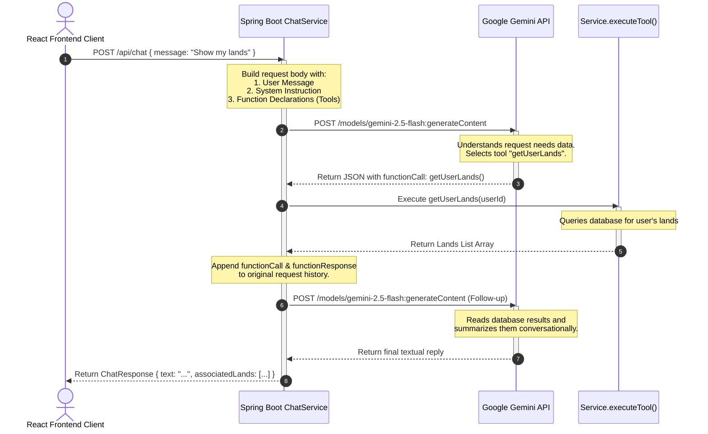

# Chapter 6.1 AI Chatbot Module

## 6.1.1 Overview of Chatbot Module
To make precision forestry accessible and interactive, **TerraSpotter** integrates an intelligent **Agentic AI Chatbot** directly into the user interface. Powered by Google's **Gemini 2.5 Flash** model, the chatbot acts as a "Forestry Consultant" that can engage in general conversational dialogue, advise users on agricultural practices, retrieve records of their registered lands, and autonomously refresh or query machine learning recommendations.

---

## 6.1.2 Large Language Model Configuration
- **Model Version:** `gemini-2.5-flash`
- **API Endpoint:** `https://generativelanguage.googleapis.com/v1beta/models/gemini-2.5-flash:generateContent`
- **Integration Layer:** Handled entirely on the Spring Boot backend (`ChatService.java`) using Java's standard `HttpClient` communicating with the Google Generative Language REST endpoints.

---

## 6.1.3 Prompt Engineering & System Instruction Strategy
The chatbot uses a system instruction model (system prompt) to constrain its behavior, define its persona, and restrict database information leaks.

### System Prompt Template
```text
You are TerraSpotter AI assistant. 
Help users with plantation decisions. 
Use tools when data is needed (e.g. to get user lands, or recommendations). 
Do not guess user data. 
Always prefer API results over assumptions. 
Be conversational and encouraging, add emojis where appropriate.
```

### Core Design Strategies
1. **Persona Enforcement:** Establishes the agent as an encouraging forestry assistant.
2. **Hallucination Prevention:** The model is explicitly commanded to utilize tools for accessing user-related data rather than guessing.
3. **Fallback Safety:** The agent is guided to rely on actual API return structures, ensuring it admits ignorance if database records are empty or inaccessible.

---

## 6.1.4 Chatbot Capabilities & Supported Queries
The chatbot can answer both static knowledge-base questions and dynamic, data-driven queries:

### 1. General Forestry Consulting
- **Supported Queries:** "How often should I water a young Neem sapling?", "What are the ecological benefits of Bamboo?", "How does sandy soil affect moisture retention?"
- **Response Handling:** The model answers using its built-in knowledge.

### 2. User Land Portfolio Audits
- **Supported Queries:** "What lands do I have registered?", "Show my mapped plots."
- **Response Handling:** Triggers database queries to extract the user's land metadata.

### 3. Precision Recommendation Querying
- **Supported Queries:** "What trees are recommended for my plot with ID 4?", "Why is Pine recommended for my hill land?"
- **Response Handling:** Queries the PostgreSQL database for the recommendations table.

### 4. Autonomous Telemetry Refresh
- **Supported Queries:** "Can you refresh the recommendations for plot 2?", "Recalculate plant suggestions for my land."
- **Response Handling:** Triggers weather API queries, recalculates ML scoring, updates database tables, and presents the output.

---

## 6.1.5 Function Calling (Backend Tool Integration)
The chatbot utilizes **Gemini Function Calling (Tools)**. Rather than letting the model guess, the backend passes a schema of executable "tools" during the API invocation. Gemini determines if a query needs tool execution and returns a structured request.

Below is the registry of function schemas exposed to the model:

### 1. `getUserLands`
- **Description:** Fetch all lands of the logged-in user.
- **Arguments:** None.
- **Backend Function:** `landService.getLandsByUser(userId)`

### 2. `getRecommendations`
- **Description:** Get plant recommendations for a specific land ID.
- **Arguments:** `landId` (String, Required).
- **Backend Function:** `recommendationRepository.findByLandId(landId)`

### 3. `refreshRecommendations`
- **Description:** Refresh or generate new ML plant recommendations for a land ID.
- **Arguments:** `landId` (String, Required).
- **Backend Function:** `landService.refreshRecommendations(landId)`

---

## 6.1.6 Request-Response Workflow (Sequence)
The conversation cycle uses a two-turn message execution pattern when a function call is requested:



---

## 6.1.7 Security Restrictions & Sandbox Enforcement

1. **Authentication Guard:** The backend `/api/chat` controller enforces HTTP Session validation. Chat requests from unauthenticated clients return a `401 Unauthorized` response before reaching the LLM service.
2. **Access Control Sandbox:** Since function calls are resolved on the Spring Boot backend rather than in the client's browser, users could attempt to query or edit lands belonging to other accounts by typing arbitrary IDs (e.g., "Refresh recommendations for land 99"). 
   - To prevent this, the backend `executeTool` routine intercepts all arguments and performs owner verification:
     ```java
     if (landService.getLandsByUser(userId).stream().noneMatch(l -> l.getId().equals(landId))) {
         return "Error: Land not found or access denied.";
     }
     ```
     This forces the tool to return an error status to the LLM if a user tries to query unauthorized lands, shielding confidential details.

---

## 6.1.8 Example User Interactions

### Example 1: Querying Personal Lands
- **User:** *"What lands have I uploaded?"*
- **Chatbot Tool Call:** `getUserLands()`
- **Backend Execution Result:**
  ```json
  [
    { "id": 12, "title": "Mango Orchard Plot", "areaSqm": 1500.0, "landStatus": "Vacant" }
  ]
  ```
- **Chatbot Final Output:** *"You have one registered land: **Mango Orchard Plot** (ID: 12) covering 1,500 square meters. It is currently vacant. 🥭 Let me know if you want recommendations for this plot!"*

### Example 2: Accessing Recommendations
- **User:** *"What trees are best for plot 12?"*
- **Chatbot Tool Call:** `getRecommendations(landId=12)`
- **Backend Execution Result:**
  ```json
  [
    { "plantName": "Mango", "suitabilityScore": 0.95, "reason": "High clay soil compatibility | Humid tropical conditions" },
    { "plantName": "Neem", "suitabilityScore": 0.88, "reason": "Drought tolerant | Improves soil fertility" }
  ]
  ```
- **Chatbot Final Output:** *"Based on the telemetry for **Mango Orchard Plot**, the best options are: 1. **Mango** (95% suitability) as it thrives in your clay soil and tropical environment. 2. **Neem** (88% suitability) which is highly drought-tolerant. 🌱"*
