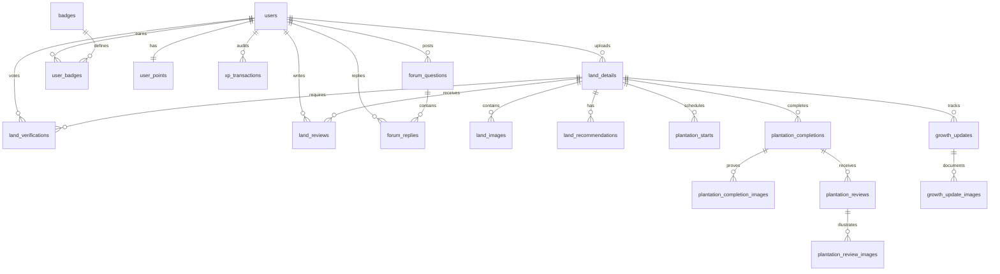

# Chapter 4.5 Database Design

## 4.5.1 Database Overview
The **TerraSpotter** platform leverages a relational database architecture powered by **PostgreSQL** to manage spatial telemetry, machine learning recommendations, user transactions, community discussions, and gamification metrics. PostgreSQL was selected for its robust support of JSONB columns (crucial for storing dynamic geo-coordinates from user drawings) and strong transactional capabilities to ensure the integrity of the XP ledger.

The database is mapped on the backend using **Spring Data JPA** with **Hibernate** acting as the Object-Relational Mapping (ORM) layer. The database schema consists of **19 tables** structured to minimize redundancy, enforce referential integrity, and support high-throughput write and read operations.

---

## 4.5.2 Detailed Schema Definition (Table by Table)

### 1. Table Name: `users`
* **Purpose:** Stores user profiles, authentication metadata, and role attributes.
* **Columns:**
  - `id` (BIGINT, PK, Auto-increment)
  - `fname` (VARCHAR(255)) - First Name
  - `lname` (VARCHAR(255)) - Last Name
  - `email` (VARCHAR(255), UNIQUE, NOT NULL) - Email address used for authentication
  - `phone_no` (VARCHAR(50)) - Contact details
  - `dob` (DATE) - Date of birth
  - `role` (VARCHAR(50)) - Access role (e.g. ROLE_USER, ROLE_ADMIN)
  - `password` (VARCHAR(255), NOT NULL) - BCrypt encrypted password hash
* **Primary Key:** `id`
* **Constraints:** Unique index on `email`.
* **Relationships:**
  - One-to-Many with `land_details` (via `createdBy`)
  - One-to-Many with `land_verifications` (via `userId`)
  - One-to-Many with `land_reviews` (via `userId`)
  - One-to-Many with `user_badges` (via `userId`)
  - One-to-One with `user_points` (via `userId`)
  - One-to-Many with `xp_transactions` (via `userId`)
  - One-to-Many with `forum_questions` (via `author_id`)
  - One-to-Many with `forum_replies` (via `author_id`)

### 2. Table Name: `land_details`
* **Purpose:** Core catalog of mapped land parcels, containing area calculations, ownership documentation, and spatial metadata.
* **Columns:**
  - `id` (BIGINT, PK, Auto-increment)
  - `title` (VARCHAR(255)) - Title of the land
  - `description` (VARCHAR(2000)) - General description
  - `polygon_coords` (JSONB) - GeoJSON/Coordinate arrays representing land polygon boundaries
  - `centroid_lat` (DOUBLE PRECISION) - Calculated latitude centroid for climate querying
  - `centroid_lng` (DOUBLE PRECISION) - Calculated longitude centroid for climate querying
  - `area_sqm` (DOUBLE PRECISION) - Mapped area in square meters
  - `estimated_tree_capacity` (INTEGER) - Maximum tree capacity computed by SpatialGridService
  - `owner_name` (VARCHAR(255)) - Owner name
  - `owner_phone` (VARCHAR(50)) - Owner phone number
  - `ownership_type` (VARCHAR(100)) - Type (e.g., Private, Public, Community)
  - `permission_status` (VARCHAR(100)) - Permission verification
  - `land_status` (VARCHAR(100)) - Status (e.g., Vacant, Under Plantation)
  - `water_available` (VARCHAR(50)) - Water availability details
  - `water_frequency` (VARCHAR(100)) - Watering frequency
  - `fencing` (BOOLEAN) - Flag indicating fencing
  - `notes` (VARCHAR(1000)) - Additional notes
  - `status` (VARCHAR(50)) - Verification status (PENDING, APPROVED, REJECTED)
  - `created_by` (BIGINT) - Foreign key referencing `users(id)`
  - `created_at` (TIMESTAMP) - Timestamp of upload
  - `access_road` (VARCHAR(255)) - Accessibility details
  - `soil_type` (VARCHAR(100)) - Mapped soil type
  - `nearby_landmark` (VARCHAR(255)) - Mapped landmarks
  - `plantation_user_id` (BIGINT) - Foreign key referencing `users(id)` (active planter)
* **Primary Key:** `id`
* **Foreign Keys:**
  - `created_by` REFERENCES `users(id)` ON DELETE SET NULL
  - `plantation_user_id` REFERENCES `users(id)` ON DELETE SET NULL
* **Relationships:**
  - One-to-Many with `land_images` (via `landId`)
  - One-to-Many with `land_verifications` (via `landId`)
  - One-to-Many with `land_reviews` (via `landId`)
  - One-to-Many with `land_recommendations` (via `landId`)
  - One-to-Many with `plantation_starts` (via `landId`)
  - One-to-Many with `plantation_completions` (via `landId`)

### 3. Table Name: `land_images`
* **Purpose:** Links multiple Cloudinary reference photo URLs to registered land parcels.
* **Columns:**
  - `id` (BIGINT, PK, Auto-increment)
  - `land_id` (BIGINT, NOT NULL) - Foreign key referencing `land_details(id)`
  - `image_url` (VARCHAR(1000), NOT NULL) - Cloudinary secure URL
  - `created_at` (TIMESTAMP)
* **Primary Key:** `id`
* **Foreign Keys:**
  - `land_id` REFERENCES `land_details(id)` ON DELETE CASCADE

### 4. Table Name: `land_verifications`
* **Purpose:** Stores crowdsourced approval or rejection votes cast by community verifiers for pending land uploads.
* **Columns:**
  - `id` (BIGINT, PK, Auto-increment)
  - `land_id` (BIGINT, NOT NULL) - Foreign key referencing `land_details(id)`
  - `user_id` (BIGINT, NOT NULL) - Foreign key referencing `users(id)`
  - `vote` (VARCHAR(50), NOT NULL) - "APPROVE" or "REJECT"
  - `created_at` (TIMESTAMP)
* **Primary Key:** `id`
* **Foreign Keys:**
  - `land_id` REFERENCES `land_details(id)` ON DELETE CASCADE
  - `user_id` REFERENCES `users(id)` ON DELETE CASCADE
* **Constraints:** Unique composite constraint on `(land_id, user_id)` (one vote per user per land).

### 5. Table Name: `land_reviews`
* **Purpose:** Feasibility reviews, ratings, and permission verification feedback uploaded by user monitors for land parcels.
* **Columns:**
  - `id` (BIGINT, PK, Auto-increment)
  - `land_id` (BIGINT, NOT NULL) - REFERENCES `land_details(id)`
  - `user_id` (BIGINT, NOT NULL) - REFERENCES `users(id)`
  - `rating` (INTEGER, NOT NULL) - User score (1 to 5)
  - `feasibility_note` (VARCHAR(255))
  - `permission_note` (VARCHAR(255))
  - `body` (VARCHAR(2000)) - Textual review feedback
  - `created_at` (TIMESTAMP)
* **Primary Key:** `id`
* **Foreign Keys:**
  - `land_id` REFERENCES `land_details(id)` ON DELETE CASCADE
  - `user_id` REFERENCES `users(id)` ON DELETE CASCADE

### 6. Table Name: `land_recommendations`
* **Purpose:** Stores the ML-suggested tree species and calculated suitability percentages for land parcels.
* **Columns:**
  - `id` (BIGINT, PK, Auto-increment)
  - `land_id` (BIGINT, NOT NULL) - REFERENCES `land_details(id)`
  - `plant_name` (VARCHAR(255), NOT NULL) - Tree species name
  - `suitability_score` (DOUBLE PRECISION) - Probability value between 0.0 and 1.0
  - `reason` (VARCHAR(1000)) - Concatenated textual justifications (e.g. Reason 1 | Reason 2 | Reason 3)
  - `created_at` (TIMESTAMP)
* **Primary Key:** `id`
* **Foreign Keys:**
  - `land_id` REFERENCES `land_details(id)` ON DELETE CASCADE

### 7. Table Name: `badges`
* **Purpose:** Catalog of gamification achievements, defining titles, details, trigger constraints, and threshold parameters.
* **Columns:**
  - `id` (BIGINT, PK, Auto-increment)
  - `name` (VARCHAR(255), UNIQUE, NOT NULL) - Name of the badge
  - `description` (TEXT)
  - `icon_code` (VARCHAR(100)) - SVG or Font icon slug
  - `trigger_type` (VARCHAR(100)) - Action constraint (e.g., ADD_LAND, COMPLETE_PLANTATION)
  - `threshold` (INTEGER, NOT NULL) - Action count required to unlock
* **Primary Key:** `id`
* **Constraints:** Unique index on `name`.

### 8. Table Name: `user_badges`
* **Purpose:** Join table capturing achievements earned by users.
* **Columns:**
  - `id` (BIGINT, PK, Auto-increment)
  - `user_id` (BIGINT, NOT NULL) - REFERENCES `users(id)`
  - `badge_id` (BIGINT, NOT NULL) - REFERENCES `badges(id)`
  - `earned_at` (TIMESTAMP)
* **Primary Key:** `id`
* **Foreign Keys:**
  - `user_id` REFERENCES `users(id)` ON DELETE CASCADE
  - `badge_id` REFERENCES `badges(id)` ON DELETE CASCADE
* **Constraints:** Unique composite constraint on `(user_id, badge_id)`.

### 9. Table Name: `user_points`
* **Purpose:** Gamification state ledger tracking user levels, overall XP balances, and active transaction streaks.
* **Columns:**
  - `id` (BIGINT, PK, Auto-increment)
  - `user_id` (BIGINT, UNIQUE, NOT NULL) - REFERENCES `users(id)`
  - `total_xp` (INTEGER, NOT NULL) - Total accumulated experience points
  - `level` (INTEGER, NOT NULL) - Current rank level (derived: level = 1 + sqrt(XP/100))
  - `streak` (INTEGER, NOT NULL) - Days of consecutive activity
  - `last_activity_date` (DATE)
  - `created_at` (TIMESTAMP)
* **Primary Key:** `id`
* **Foreign Keys:**
  - `user_id` REFERENCES `users(id)` ON DELETE CASCADE

### 10. Table Name: `xp_transactions`
* **Purpose:** Transaction ledger storing an audit log for every experience point (XP) transaction awarded.
* **Columns:**
  - `id` (BIGINT, PK, Auto-increment)
  - `user_id` (BIGINT, NOT NULL) - REFERENCES `users(id)`
  - `action` (VARCHAR(100), NOT NULL) - Action key (e.g., ADD_LAND, START_PLANTATION)
  - `xp_awarded` (INTEGER, NOT NULL) - Quantity of XP awarded
  - `reference_id` (BIGINT) - ID of the record triggering this award
  - `description` (VARCHAR(255)) - Description of transaction
  - `created_at` (TIMESTAMP)
* **Primary Key:** `id`
* **Foreign Keys:**
  - `user_id` REFERENCES `users(id)` ON DELETE CASCADE

### 11. Table Name: `plantation_starts`
* **Purpose:** Schedules upcoming plantation events, detailing planned dates, methods, target trees, and team sizes.
* **Columns:**
  - `id` (BIGINT, PK, Auto-increment)
  - `land_id` (BIGINT, NOT NULL) - REFERENCES `land_details(id)`
  - `user_id` (BIGINT, NOT NULL) - REFERENCES `users(id)`
  - `planned_date` (DATE, NOT NULL)
  - `team_size` (INTEGER)
  - `trees_to_plant` (INTEGER)
  - `method` (VARCHAR(255))
  - `notes` (VARCHAR(1000))
  - `created_at` (TIMESTAMP)
* **Primary Key:** `id`
* **Foreign Keys:**
  - `land_id` REFERENCES `land_details(id)` ON DELETE CASCADE
  - `user_id` REFERENCES `users(id)` ON DELETE CASCADE

### 12. Table Name: `plantation_completions`
* **Purpose:** Records successful plantation completions, tracking tree counts and remaining space.
* **Columns:**
  - `id` (BIGINT, PK, Auto-increment)
  - `land_id` (BIGINT, NOT NULL) - REFERENCES `land_details(id)`
  - `user_id` (BIGINT, NOT NULL) - REFERENCES `users(id)`
  - `trees_planted` (INTEGER, NOT NULL) - Actual number of trees planted
  - `more_capacity` (INTEGER) - Updated remaining sapling capacity on the land
  - `notes` (TEXT)
  - `created_at` (TIMESTAMP)
* **Primary Key:** `id`
* **Foreign Keys:**
  - `land_id` REFERENCES `land_details(id)` ON DELETE CASCADE
  - `user_id` REFERENCES `users(id)` ON DELETE CASCADE

### 13. Table Name: `plantation_completion_images`
* **Purpose:** Securely references visual upload proofs (Cloudinary URLs) attached to plantation completion reports.
* **Columns:**
  - `id` (BIGINT, PK, Auto-increment)
  - `completion_id` (BIGINT, NOT NULL) - REFERENCES `plantation_completions(id)`
  - `image_url` (VARCHAR(1000), NOT NULL)
  - `created_at` (TIMESTAMP)
* **Primary Key:** `id`
* **Foreign Keys:**
  - `completion_id` REFERENCES `plantation_completions(id)` ON DELETE CASCADE

### 14. Table Name: `plantation_reviews`
* **Purpose:** Peer reviews and checks submitted by other community users for public completed plantation showcase items.
* **Columns:**
  - `id` (BIGINT, PK, Auto-increment)
  - `completion_id` (BIGINT, NOT NULL) - REFERENCES `plantation_completions(id)`
  - `user_id` (BIGINT, NOT NULL) - REFERENCES `users(id)`
  - `user_name` (VARCHAR(255), NOT NULL) - Name of reviewer
  - `rating` (INTEGER, NOT NULL)
  - `comment` (TEXT, NOT NULL)
  - `created_at` (TIMESTAMP)
* **Primary Key:** `id`
* **Foreign Keys:**
  - `completion_id` REFERENCES `plantation_completions(id)` ON DELETE CASCADE

### 15. Table Name: `plantation_review_images`
* **Purpose:** Mapped images attached to a completed plantation review.
* **Columns:**
  - `id` (BIGINT, PK, Auto-increment)
  - `review_id` (BIGINT, NOT NULL) - REFERENCES `plantation_reviews(id)`
  - `image_url` (VARCHAR(1000), NOT NULL)
  - `created_at` (TIMESTAMP)
* **Primary Key:** `id`
* **Foreign Keys:**
  - `review_id` REFERENCES `plantation_reviews(id)` ON DELETE CASCADE

### 16. Table Name: `growth_updates`
* **Purpose:** Stores periodic growth reporting metrics (survival rates, heights, health) submitted for planted lands.
* **Columns:**
  - `id` (BIGINT, PK, Auto-increment)
  - `land_id` (BIGINT, NOT NULL) - REFERENCES `land_details(id)`
  - `user_id` (BIGINT, NOT NULL) - REFERENCES `users(id)`
  - `user_name` (VARCHAR(255))
  - `average_height_cm` (INTEGER)
  - `survival_rate` (INTEGER) - Estimated survival percentage (0% to 100%)
  - `health_status` (VARCHAR(100)) - General health evaluation
  - `notes` (TEXT)
  - `created_at` (TIMESTAMP)
* **Primary Key:** `id`
* **Foreign Keys:**
  - `land_id` REFERENCES `land_details(id)` ON DELETE CASCADE
  - `user_id` REFERENCES `users(id)` ON DELETE CASCADE

### 17. Table Name: `growth_update_images`
* **Purpose:** Connects photos to growth updates for tree monitoring visual proof.
* **Columns:**
  - `id` (BIGINT, PK, Auto-increment)
  - `update_id` (BIGINT, NOT NULL) - REFERENCES `growth_updates(id)`
  - `image_url` (VARCHAR(1000), NOT NULL)
  - `created_at` (TIMESTAMP)
* **Primary Key:** `id`
* **Foreign Keys:**
  - `update_id` REFERENCES `growth_updates(id)` ON DELETE CASCADE

### 18. Table Name: `forum_questions`
* **Purpose:** Stores community discussion question threads.
* **Columns:**
  - `id` (BIGINT, PK, Auto-increment)
  - `title` (VARCHAR(200), NOT NULL)
  - `content` (TEXT, NOT NULL)
  - `author_id` (BIGINT, NOT NULL) - REFERENCES `users(id)`
  - `created_at` (TIMESTAMP)
* **Primary Key:** `id`
* **Foreign Keys:**
  - `author_id` REFERENCES `users(id)` ON DELETE CASCADE

### 19. Table Name: `forum_replies`
* **Purpose:** Comments, answers, and dialogue threads linked to community forum questions.
* **Columns:**
  - `id` (BIGINT, PK, Auto-increment)
  - `content` (TEXT, NOT NULL)
  - `author_id` (BIGINT, NOT NULL) - REFERENCES `users(id)`
  - `question_id` (BIGINT, NOT NULL) - REFERENCES `forum_questions(id)`
  - `created_at` (TIMESTAMP)
* **Primary Key:** `id`
* **Foreign Keys:**
  - `author_id` REFERENCES `users(id)` ON DELETE CASCADE
  - `question_id` REFERENCES `forum_questions(id)` ON DELETE CASCADE

---

## 4.5.3 Entity-Relationship (ER) Summary
The schema follows a centralized star-like relational structure:
- **`users`** sits at the center of the user activity domain, branching into profiles, discussion authorship, reviews, verifications, and gamification points.
- **`land_details`** serves as the center for the geographic domain, mapping coordinates and dimensions, linking to verification queues, tree recommendations, plantation events, and growth logs.
- **`plantation_completions`** connects the land and user domains to track successful reforestation drives, with nested image sets and community reviews.

---

## 4.5.4 Database Normalization Discussion
To preserve data integrity, prevent anomalies, and streamline transaction locks, the database design complies with the **Third Normal Form (3NF)**:

### First Normal Form (1NF)
- **Rules Met:** All tables contain atomic cells. Repeating groups and array lists (like multiple image links or reviews) are extracted into separate entities (`land_images`, `plantation_completion_images`) rather than packed into CSV string lists.
- **Geodata Handling:** The polygon coordinates list is stored in a structured JSONB column, managed natively as a single binary attribute by PostgreSQL.

### Second Normal Form (2NF)
- **Rules Met:** All tables have a single-attribute auto-incrementing Primary Key (`id`), resolving partial dependencies.
- **Junction Tables:** For composite relationship entities (`land_verifications`, `user_badges`), columns depend on the entire primary key, and composite unique indices prevent duplicate entries.

### Third Normal Form (3NF)
- **Rules Met:** Transitive dependencies have been eliminated.
- **Example:** In `user_points`, current levels are calculated on the fly or depend directly on `user_id`. Historical XP transactions log static point adjustments in `xp_transactions`, referencing the target `user_id` without carrying user contact details (fname, lname), which are fetched by joining with `users`.

---

## 4.5.5 Database Statistics
- **Total Tables:** 19
- **Primary Keys:** 19 (all tables utilize surrogate sequence IDs)
- **Foreign Key Constraints:** 23
- **Unique Constraints:** 5 (`users.email`, `badges.name`, `user_points.user_id`, composite `land_verifications(land_id, user_id)`, composite `user_badges(user_id, badge_id)`)
